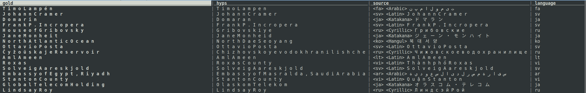

# Experiments

This README contains notes about the experiments in our paper.

## Canonical name translation

The canonical name translation experiments are conducted using `fairseq`. All of the experiments can be found under `./experiments/canonical_name_translation/.`

```
experiments/canonical_name_translation/
├── all2en
│   ├── pn-tag-ablation-lang-script-seed1917   
└── en2all
    ├── pn-rev-tag-ablation-lang-seed1917
```

For data size only a single seed is provided for each experiment. Please contact the authors for the complete data.

### Experiment folder

A single experiment looks like this:

```
├── binarized_data -> /symlink/destination          <----- data binarized using fairseq (not included)
├── checkpoints -> /symlink/destination             <----- checkpoints for fairseq model (not included)
├── raw_data -> /symlink/destination                <----- raw data (see data folder)
├── dev_set_eval                                    <----- dev set evaluations
│   ├── dev_eval_results.tsv
│   ├── dev.eval.score                              <----- scores (CER/Mean F1/accuracy)
│   ├── dev.gold                                    <----- gold outputs
│   ├── dev.hyps                                    <----- hypotheses (model outputs)
│   ├── dev.languages                               <----- the language of each dev set example
│   ├── dev.out                                     <----- raw fairseq output
│   ├── dev.source                                  <----- source-side inputs
│   ├── dev_with_source_and_langs.tsv
│   └── dev_with_source.tsv
└── test_set_eval                                   <----- test set evals
    ├── test_eval_results.tsv                       |
    ├── test.eval.score                             |
    ├── test.gold                                   |
    ├── test.hyps                                   |
    ├── test.languages                              |  Files same as above in dev set case
    ├── test.out                                    |
    ├── test.source                                 |
    ├── test_with_source_and_langs.tsv              |
    └── test_with_source.tsv                        |

```

### Experimental outputs

The experimental outputs are contained in `{dev,test}.{source,hyps,gold}`.

**Source**

The source input consists of any potential tags followed by the characters of the entity name.

```
<vi> <Latin> G e r h a r d A r m a u e r H a n s e n
<ja> <Hiragana> 一 ノ 瀬 さ く ら
<sv> <Latin> H e a t h M e l l o
<he> <Hebrew> ש ג ר י ר ו ת ת א י ל נ ד ב ס י א ו ל
<ja> <Katakana> セ ヴ ィ ア ー ヴ ィ ル
<ru> <Cyrillic> Ч ё р т о в П а л е ц
<ru> <Cyrillic> В а л ь т е р Б р а н д м ю л л е р
<ar> <Arabic> ج و ر ج ب ا ر ي ش
<he> <Hebrew> צ ' ס ט נ א ט ג ר ו ב
<ru> <Cyrillic> Л о п а т и н а
```

**Hypotheses/model outputs**

The model outputs are character-level transliterations of the source-side character sequence:

```
G e r h a r d A r m a u e r H a n s e n
S a k u r a I c h i n o s e
H e a t h M e l l o
e m b a s s y o f T h a i l a n d i n S e o u l
S e v i e r v i l l e
C h ë r t o v P a l e t s
W a l t e r B r a n d m ü l l e r
G e o r g e B a r r i c h
C h e s t a n a t G r o v e
L o p a t i n a
```

**Gold / references**

The gold outputs are also character-segmented plaintext files:

```
G e r h a r d A r m a u e r H a n s e n
S a k u r a I c h i n o s e
H e a t h M e l l o
E m b a s s y o f T h a i l a n d , S e o u l
S e v i e r v i l l e
C h ë r t o v P a l e t s
W a l t e r B r a n d m ü l l e r
G e o r g e P a r r i s h
C h e s t n u t G r o v e
L o p a t i n a , P e r m K r a i
```

**TSV format**

An easier way to view the outputs together is to take a look at `test_with_source_and_langs.tsv`.

The colums are:

- Gold
- Hypotheses
- Source
- Language

Below is a view of the TSV with `visidata`:



### Evaluation & results

#### Metrics

We evaluate using three metrics

- Accuracy: exact match between gold reference and model outputoutput
- Character error rate: like Word Error Rate but computed at character level
- Mean F1: longest common subsequence-based sequence similarity
  - Called "Fuzziness-in-Top-1" by [Chen et al (2018)](https://aclanthology.org/W18-2409/)
  - Also similar to ROUGE-L by [Lin et al (2004)](https://aclanthology.org/W04-1013/)

#### Looking at data

The easiest way to look at the evaluation results is to look at `{test,dev}_eval_results.tsv`:

```
CER                   Accuracy              F1                    Language
0.376                 18.46                 84.25                 ur
0.308                 42.48                 88.796                ko
0.158                 77.74                 93.694                vi
0.19                  46.76                 93.069                ar
0.231                 48.795                91.504                global
0.25                  37.16                 91.181                he
0.291                 30.98                 89.921                el
0.351                 42.6                  89.116                ru
[...]
```

Plaintext versions of the scores are available in `{dev,test}.eval.score` as well:

```
ru:
Word Accuracy   45.1000
Mean F1 91.9185
CER     0.2267
WER     54.9000
BLEU    73.6303

lv:
Word Accuracy   75.0000
Mean F1 96.6544
CER     0.0986
WER     25.0000
BLEU    88.0780

[...]
```

## Named entity recognition

The NER experiments can be found under `./experiments/named_entity_recognition/.`

```
experiments/named_entity_recognition/
├── hiner
├── masakhaner
├── masakhaner_dim_sweep
├── turku
```

### Hyperparameter sweeps

| Hyperparameter | Values |
| --- | --- |
| Type disambiguation in OurResource | on, off |
| Autoencoder loss | on, off |
| Soft gaz. features |  |
| ... at CRF layer | on, off |
| ... at LSTM layer | on, off |
| LSTM/word embedding dimension | 128, 200, 256 |
| Random seed | randint |

### Experiment folder

A single experiment looks like this:

```
├── dev-output
│   ├── dev.temp.kin_no_softgaz_bsz16
│   ├── hypotheses                      <---- predicted tags
│   ├── hypotheses_with_tokens
│   ├── references                      <---- ground truth tags
│   ├── references_with_tokens
│   ├── score_dev.tsv                   <---- scores
│   ├── score_dev.txt
│   └── tokens
└── test-output
    ├── hypotheses                      <---- predicted tags
    ├── hypotheses_with_tokens
    ├── references                      <---- ground truth tags
    ├── references_with_tokens
    ├── score_test.tsv                  <---- scores
    ├── score_test.txt
    ├── test.kin_no_softgaz_bsz16
    └── tokens                          <---- tokens
```

### Experimental outputs

The experimental outputs are contained in `{dev,test}-output/{hypotheses,references}_with_tokens`.

```
N'aka   O
nke     O
ọzọ     O
,       O
BBC     B-ORG
Igbo    O
gbakwara        O
onye    O
ọrụ     O
INEC    B-ORG
Imo     B-LOC
steeti  I-LOC
bụ      O
Odiziakụ        B-PER
Benson  I-PER
ajụjụọnụ        O
mana    O
o       O
kwuru   O
na      O
```

## Evaluation & results

### Evaluation & results

#### Metrics

We evaluate using three metrics: precision, recall and F1. All metrics are computed at the span level using `seqscore`.

#### Looking at data

The easiest way to look at the evaluation results is to look at `score_{test,dev}.tsv` (TSV):

```
Type    Precision       Recall  F1      Reference       Predicted       Correct
ALL     80.79   78.46   79.60   1179    1145    925
DATE    67.16   62.07   64.52   145     134     90
LOC     78.99   87.87   83.19   338     376     297
ORG     87.89   72.36   79.38   351     289     254
PER     82.08   82.32   82.20   345     346     284
```

The `.txt` files contain more terminal-friendly plaintext tables:

```
| Type   |   Precision |   Recall |     F1 |   Reference |   Predicted |   Correct |
|--------|-------------|----------|--------|-------------|-------------|-----------|
| ALL    |       80.79 |    78.46 |  79.60 |        1179 |        1145 |       925 |
| DATE   |       67.16 |    62.07 |  64.52 |         145 |         134 |        90 |
| LOC    |       78.99 |    87.87 |  83.19 |         338 |         376 |       297 |
| ORG    |       87.89 |    72.36 |  79.38 |         351 |         289 |       254 |
| PER    |       82.08 |    82.32 |  82.20 |         345 |         346 |       284 |
```
